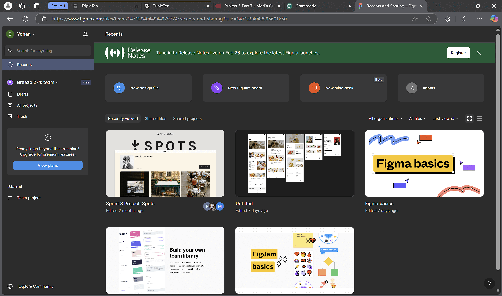
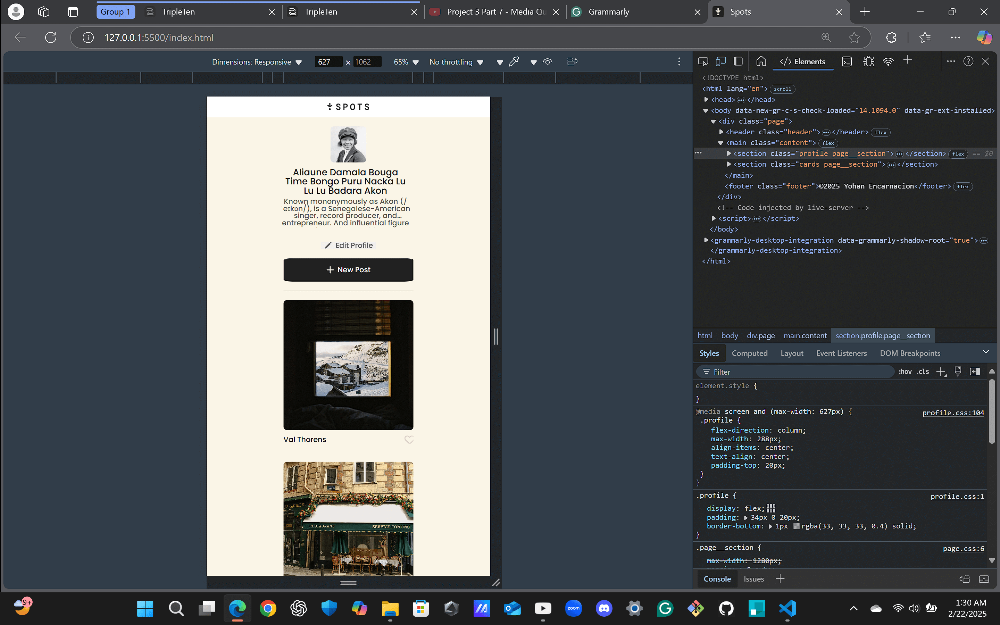
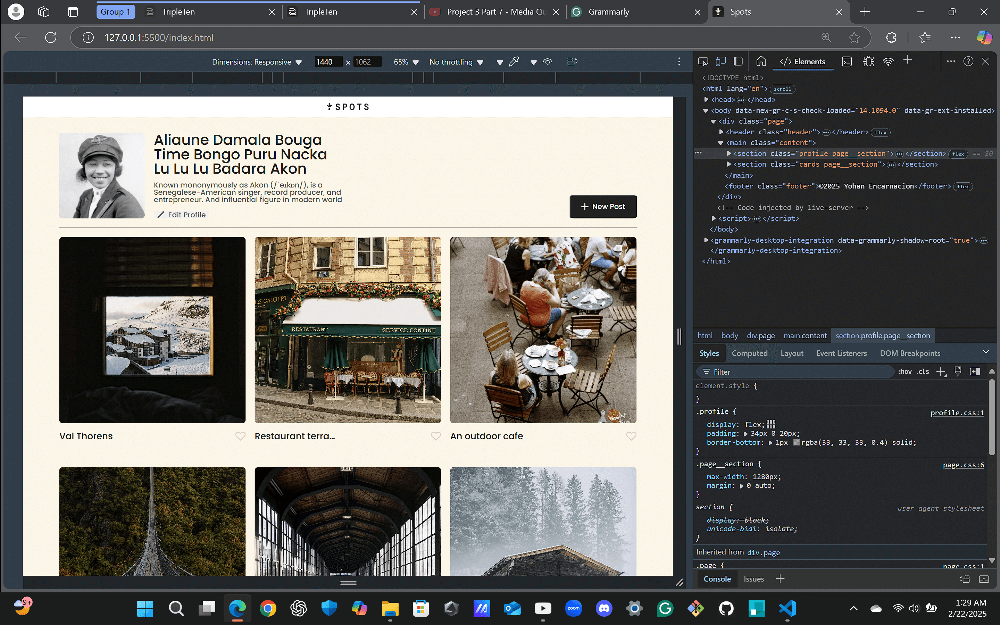

# Project 3: Spots

## Decription

This is the third project of the Software Engineering program at TripleTen. It was created using HTML and CSS, based on the design that was provided for us through Figma in order to create a responsive website. The project contained images that were provided to us, among those images was an avatar image of Bessie Coleman along with a couple of different sets of images that display different cinerary, with this in our possession we created a responsive website.

The project still follows the BEM methodology on each HTML Semantic tag in order to make our website's code readable and clean. We were instructed to create a responsive website using the Figma design we were given in order to make a website that will be displayed across all screen devices,  To make this happen we used the Figma design to set up our website in the HTML5 after that, It was to CSS where we then learn to play around with the design kind of like a puzzle we were verifying through trial and error which pieces go where this is where we got introduce to media queries, By using what we learned about media queries we were able to complete the project and make a our website responsive. We implemented things from previous lessons as well that were able to help us through the project.

We got introduced to JavaScript and started implementing it in our project in order to make a functional form and have an active button on the site so that when it is clicked it would have some action. This action will allow users to edit the profile name and description. The new post button would add more cards with images on them and finally, the delete button will remove the cards. We use the CSS again to add a transition any time the user clicks on both the cards and the edit, new post button popups.    

## Project features

- Semantic HTML5
- BEM Method
- Figma
- Flexbox
- Grid
- Media Queries
- Positioning
- Flat BEM file structure
- JavaScript

## Improvements Made To Project

- The change of the for loop array method with the ForEach method to render the cards in a more efficient way.
- We created a form that will allow the user to add cards with images of their choice on the webpage.
- Modification to the new post button was made in order for it to have an action to allow users to add cards.
- The like button was also modified by making it active and a color change was made so that when the user hovers over on and off the different stages of color will take action on the button.
- We implemented a delete button to the cards and made it active with the same hover state actions as the other buttons.
- A preview stage was implemented to the cards so that the image would appear over the page, but not cover the entire page, which means that we added a new close button to exit out of it.
- We also added a transition mode to it so that when the user interacts with both the edit and new post buttons the transition will take place, The same goes for when the user interacts with the cards(if you click on the card you will see the transition happen like in the button).

## Figma

- [Link to the project on Figma](https://www.figma.com/file/BBNm2bC3lj8QQMHlnqRsga/Sprint-3-Project-%E2%80%94-Spots?type=design&node-id=2%3A60&mode=design&t=afgNFybdorZO6cQo-1)

## Images

## Deployment Link

[Deployment-Link]https://noname2700.github.io/se_project_spots/

## Project Link Video

[Project-Video]https://drive.google.com/file/d/12L4Hw3ChLlkI6wqZo2J4eNm6GAeluM3r/view?usp=sharing
